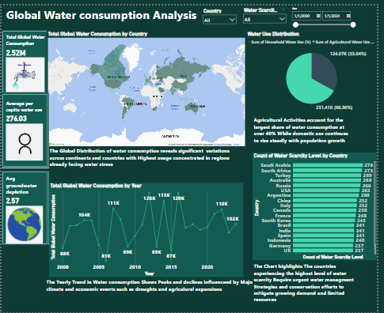

# Water Dashboard - Power BI Project

## Overview

The **Water Dashboard** is an interactive business intelligence solution built using Power BI, aiming to monitor and analyze key indicators related to **water usage, sources, and consumption patterns**. This report empowers decision-makers with real-time insights to support sustainable water management, detect irregularities, and enhance operational planning.

## Project Objectives

- Monitor total water consumption over time.
- Identify high-consumption areas or categories.
- Analyze the contribution of each water source to the overall supply.
- Support strategic planning and sustainability initiatives.
- Detect anomalies or inefficiencies in water usage.
- Provide a user-friendly interface for non-technical stakeholders.

## Key Features

### 1. **KPI Section**
- **Total Water Consumption**: Displays the total amount of water consumed within the selected period.
- **Average Daily Consumption**: Helps evaluate usage patterns.
- **Water Loss/Leak Detection** *(if included)*: Highlights discrepancies between supplied and consumed water.

### 2. **Time Analysis**
- Monthly or daily trends using line and bar charts.
- Comparison between current and previous periods.

### 3. **Geographic/Location Breakdown**
- Water usage by **region, branch, or facility**.
- Enables detection of areas with high or abnormal usage.

### 4. **Water Source Analysis**
- Breakdown by water source type (e.g., Groundwater, River, Municipal Supply).
- Helps assess reliance on different sources and sustainability implications.

### 5. **User-Friendly Slicers**
- Dynamic filters for:
  - Time periods (month, year)
  - Locations
  - Usage category (domestic, industrial, agricultural, etc.)
  - Water source

### 6. **Clean Visual Design**
- Consistent color schemes
- Clear labels and tooltips
- Responsive layout

## Data Sources

- Internal water consumption records (e.g., Excel, CSV)
- Cleaned and transformed using Power Query Editor

## Technologies Used

- **Power BI Desktop**
- **DAX** for KPIs and time intelligence calculations
- **Power Query (M)** for data transformation

## Screenshots

### Main Dashboard View

*The main interactive dashboard showcasing water consumption KPIs, source analysis, and usage trends.*

## Usage Instructions

1. Open the `Water Dashboard.pbix` file using Power BI Desktop.
2. Use the filters to explore different periods, locations, or categories.
3. Hover over visuals for deeper insights.
4. Export visuals or data summaries as needed.

## Potential Use Cases

- Municipal water departments
- Environmental NGOs
- Facility managers
- Sustainability teams

## Future Enhancements

- Integration with real-time IoT sensor data
- Predictive analysis models
- Mobile optimization
- Benchmarking across similar facilities

---

## Author

**Ahmad Yasser Faik**  
Data Analyst | Power BI Developer  
Alexandria, Egypt

- **Email**: ahmadyaser5579@gmail.com  
- **LinkedIn**: [ahmad-yasser-faiq-data-analyst](https://www.linkedin.com/in/ahmad-yasser-faiq-data-analyst)
